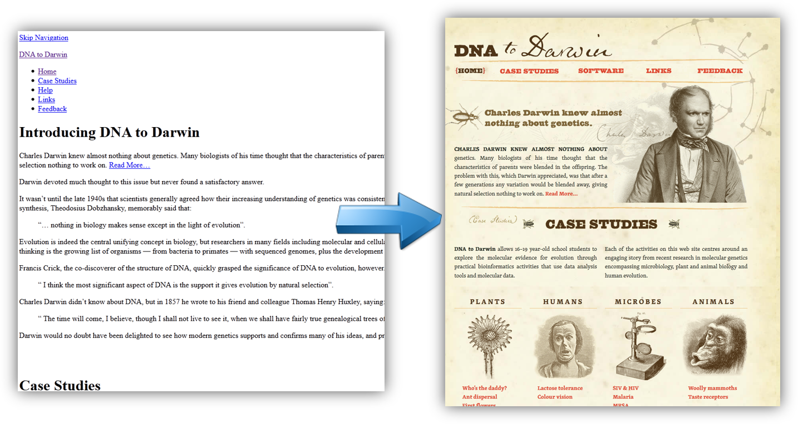

# CSS

CSS (Cascading Style Sheets) är det som ger en webbsida design, färger och layout. Det förvandlar ren HTML till visuellt tilltalande webbsidor.

## Vad är CSS?

- **CSS** står för Cascading Style Sheets
- **Beskriver** hur HTML-element ska visas på skärmen, på papper eller i andra media
- **Sparar arbete** - kan styra layouten på flera sidor samtidigt
- **Externa formatmallar** lagras i separata CSS-filer för bättre organisation

### Huvudresurs

[W3Schools CSS](https://www.w3schools.com/css/default.asp)

---

## Innehåll

1. [CSS Syntax](#1-css-syntax)
2. [CSS Selectorer](#2-css-selectorer)
3. [CSS Olika sätt](#3-css-olika-sätt)
4. [CSS Färger](#4-css-färger)
5. [CSS Bakgrunder](#5-css-backgrounds-bakgrunder)
6. [CSS Ramar](#6-css-borders-ramar)
7. [CSS Marginaler](#7-css-margins-marginaler)
8. [CSS Utfyllnad](#8-css-padding-utfyllnad)
9. [CSS Höjd/Bredd](#9-css-heightwidth)
10. [CSS Box Model](#10-css-box-model)
11. [CSS Text](#11-css-text)
12. [CSS Typsnitt](#12-css-font-typsnitt)
13. [CSS Länkar](#13-css-links-länkar)
14. [CSS Display](#14-css-display)
15. [CSS Position](#15-css-position)
16. [CSS Combinators](#16-css-combinators)
17. [CSS Flexbox](#17-css-flexbox)

## 1. CSS Syntax

CSS-syntax består av selektorer, egenskaper och värden som definierar hur element ska se ut.

### Resurser

- [W3Schools CSS Syntax](https://www.w3schools.com/css/css_syntax.asp)

---

## 2. CSS Selectorer

Selectorer används för att välja vilka HTML-element som ska påverkas av CSS-reglerna.

### Resurser

- [W3Schools CSS Selectors](https://www.w3schools.com/css/css_selectors.asp)

### Övningar

- [Övning: CSS Selectorer](https://github.com/abbjetmus/programmering/blob/master/CSS/%C3%96vningar/README.md#%C3%B6vning-0-css-selectorer)

---

## 3. CSS Olika sätt

Det finns tre huvudsakliga sätt att lägga till CSS: inline, internal och external.

### Resurser

- [W3Schools How To Add CSS](https://www.w3schools.com/css/css_howto.asp)

### Övningar

- [Övning: CSS Olika sätt](https://github.com/abbjetmus/programmering/blob/master/CSS/%C3%96vningar/README.md#%C3%B6vning-1-tre-s%C3%A4tt-att-l%C3%A4gga-till-css)

---

## 4. CSS Färger

Lär dig hur man använder färger i CSS med olika format som hex, RGB, HSL och färgnamn.

### Resurser

- [W3Schools CSS Colors](https://www.w3schools.com/css/css_colors.asp)

---

## 5. CSS Backgrounds (Bakgrunder)

Kontrollera bakgrundsfärger, bilder och andra bakgrundsegenskaper.

### Resurser

- [W3Schools CSS Backgrounds](https://www.w3schools.com/css/css_background.asp)

---

## 6. CSS Borders (Ramar)

Skapa och anpassa ramar runt element med olika stilar, bredder och färger.

### Resurser

- [W3Schools CSS Borders](https://www.w3schools.com/css/css_border.asp)

---

## 7. CSS Margins (Marginaler)

Kontrollera utrymmet utanför elementens ramar.

### Resurser

- [W3Schools CSS Margins](https://www.w3schools.com/css/css_margin.asp)

---

## 8. CSS Padding (Utfyllnad)

Kontrollera utrymmet innanför elementens ramar.

### Resurser

- [W3Schools CSS Padding](https://www.w3schools.com/css/css_padding.asp)

---

## 9. CSS Height/Width

Ställ in höjd och bredd på element för att kontrollera deras storlek.

### Resurser

- [W3Schools CSS Dimensions](https://www.w3schools.com/css/css_dimension.asp)

---

## 10. CSS Box Model

Förstå hur margin, border, padding och content fungerar tillsammans.

### Resurser

- [W3Schools CSS Box Model](https://www.w3schools.com/css/css_boxmodel.asp)

### Övningar

- [Övning: CSS Box Model](https://github.com/abbjetmus/programmering/blob/master/CSS/%C3%96vningar/README.md#%C3%B6vning-2-box-modellen)

---

## 11. CSS Text

Formatera text med egenskaper som färg, storlek, justering och radavstånd.

### Resurser

- [W3Schools CSS Text](https://www.w3schools.com/css/css_text.asp)

---

## 12. CSS Font (Typsnitt)

Kontrollera typsnitt, storlek, vikt och stil på text.

### Resurser

- [W3Schools CSS Font](https://www.w3schools.com/css/css_font.asp)

---

## 13. CSS Links (Länkar)

Styla länkar i olika tillstånd som hover, visited och active.

### Resurser

- [W3Schools CSS Links](https://www.w3schools.com/css/css_link.asp)

---

## 14. CSS Display

Kontrollera hur element visas (block, inline, flex, grid, etc.).

### Resurser

- [W3Schools CSS Display](https://www.w3schools.com/css/css_display_visibility.asp)

---

## 15. CSS Position

Positionera element med static, relative, absolute, fixed och sticky.

### Resurser

- [W3Schools CSS Position](https://www.w3schools.com/css/css_positioning.asp)

---

## 16. CSS Combinators

Kombinera selectorer för att välja specifika element baserat på deras relation.

### Resurser

- [W3Schools CSS Combinators](https://www.w3schools.com/css/css_combinators.asp)

---

## 17. CSS Flexbox

Flexbox är en modern layoutmodul som gör det enkelt att skapa flexibla och responsiva layouts.

### Vad är Flexbox?

Före Flexbox fanns fyra huvudsakliga layoutlägen:

- **Block** - för sektioner på en webbsida
- **Inline** - för text
- **Tabell** - för tvådimensionella tabelldata
- **Positionering** - för exakt positionering av element

**Flexible Box Layout Module** gör det mycket lättare att designa flexibla responsiva layouts utan att använda float eller komplicerad positionering.

### Resurser

- [W3Schools CSS Flexbox](https://www.w3schools.com/css/css3_flexbox.asp)
- [CSS-Tricks Flexbox Guide](https://css-tricks.com/snippets/css/a-guide-to-flexbox/)

### Interaktiva Övningar

- [Flexbox Froggy](https://flexboxfroggy.com/#sv) - Lär dig Flexbox genom att spela!
- [Flexbox Defense](http://www.flexboxdefense.com/) - Tower Defense med Flexbox

### Övningar

- [CSS Flexbox Övningar](./Övningar/README.md) - Praktiska layoutövningar

---

## Sammanfattning

Nu har du en komplett översikt över CSS grunderna! Börja med syntax och selectorer, arbeta dig genom box model, och avsluta med moderna layouttekniker som Flexbox. Kom ihåg att praktisera regelbundet och experimentera med olika egenskaper.
