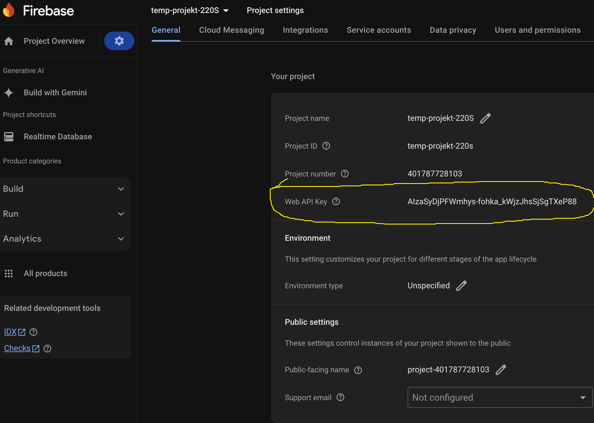

# Projekt Temperatur Sensor

<br>
I projektet temperatur-sensor så ska vi använda teknikerna vi har lärt oss i flera av kurserna och kombinera dem till att bygga ett litet IoT (Internet Of Things) projekt.
Som micro-controller ska vi använda **ESP8266**, den ska läsa av temperaturer från en temperatur-sensor och sedan skicka data/värden till en databas/backend där vi kommer använda något som heter **Firebase Realtime Database** från Google. Ni ska sedan bygga en hemsida eller en mobilapp som som visualiserar temperaturvärdena från Firebase.

## ESP8266 -> Firebase kommunikation
Första länken nedan visar biblioteket som används för att kommunicera mellan eran micro-kontroller och Firebase.<br>
Där finns beskrivning på vilken funktionalitet som det stöder och hur man använder det, viktigt att man spenderar lite tid och studerar informationen.
<br>
<br>
<https://github.com/mobizt/Firebase-ESP8266>
<br>
<br>
<br>
För att kommunicera med Firebase måste man ha ett bibliotek för det både i Arduino koden och på hemsidan. För Arduino koden är det viktigt att fäljande version används som på bilden.

Det som är nytt är att man måste använda firebase biblioteket på Arduino som heter så här


För webbsidan kan ni bara bygga vidare på mitt exempel som har biblioteket inkluderat som script-taggar.


I mappen Exempel finns exempel kod för både webb delen och arduino bitarna som man an använda.

Det är mycket kommentarer i arduino koden, så behöver ni inte skriva och kan radera kommentarerna om ni vill, de är mest för ni ska förstå koden.
Ni måste använda FIREBASE_HOST och FIREBASE_AUTH från ert firebase projekt enligt bilderna.

```c++
// Definiera Firebase-host och autentisering
#define FIREBASE_HOST ""      // Här ska du ange din Firebase-host dvs url till databasen
#define FIREBASE_AUTH ""      // Här ska du ange din Firebase-autentisering dvs web api nyckeln
```




Testa gärna hela flödet med exemplet att ni kan slå av och på lampan via hemsidan.

Länken nedan visar hur man sätter upp ett Firebase projekt.
<br><br>
<https://medium.com/@vibrologic/serverless-iots-with-firebase-realtime-database-and-esp8266-9937d98d1ae0>
<br>
<br>
<br>
Länken nedan visar hur man kopplar upp sitt Firebase projekt med ESP8266, alternativt kan man kolla på mitt exempel där jag tänder och släcker lysdioden.
<br><br>
<https://medium.com/@vibrologic/serverless-iots-with-firebase-realtime-database-and-esp8266-e624304c3197>
<br>
<br>
<br>
## Firebase Realtime Database
Firebase är en backend-plattform för att bygga webb-, Android- och IOS-applikationer. Den erbjuder databas i realtid, olika API: er, flera autentiseringstyper och en plats att hosta sin applikation.<br>
Det här är en introduktionshandledning som behandlar grunderna för Firebase-plattformen och förklarar hur man hanterar dess olika komponenter och underkomponenter.
<br><br>
<https://www.tutorialspoint.com/firebase/index.htm>
<br>
<br><br>
Här nedan är dokumentation från Firebase egna hemsida om hur man använder produkten.<br><br>
<https://firebase.google.com/docs/database>


## Hemsidan
Ni kan välja att bygga er hemsida med endast HTML, CSS och JavaScript. Men det kan vara lite svårt att designa en hemsida och därför brukar man använda någon form av CSS-bibliotek. Ett sådant bibliotek är tex Bootstrap som jag kan rekommendera att ni använder i era projekt.
Här kommer lite resurser på Bootstrap:
<br>
<br>
<https://getbootstrap.com/docs/4.0/getting-started/introduction/>
<br>
<br>
<https://www.w3schools.com/bootstrap4/bootstrap_get_started.asp>
