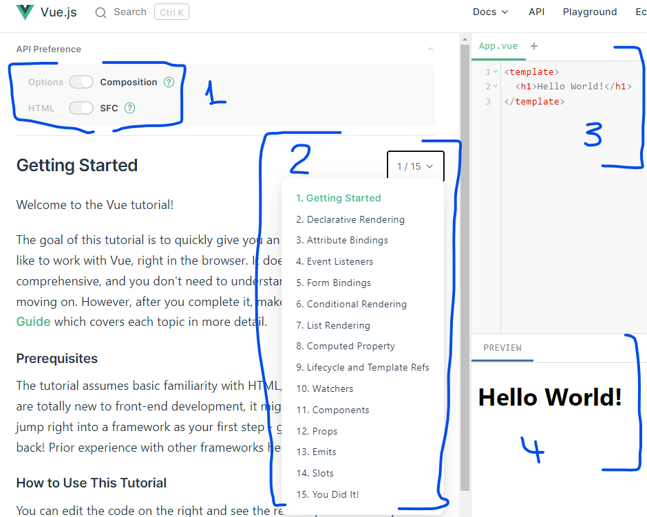

# Vue.js 3

Vue.js 3 är den senaste versionen av Vue och versionen vi kommer att använda i denna kurs.

## Snabbstart

### Viktiga resurser

- [Vue 3 Hands On Tutorial](https://vuejs.org/tutorial/#step-1) - Interaktiv övningsmiljö
- [Vue.js Officiell Dokumentation](https://vuejs.org/guide/quick-start.html)
- [Vue 3 With Danny (YouTube)](https://www.youtube.com/watch?v=9whgkjxoCME) - Videokurs
- [Vue.pptx](./Vue.pptx) - PowerPoint-presentation

---

## Introduktion

Denna guide ger dig en praktisk introduktion till Vue.js 3 med fokus på:
- **Composition API** - Modern Vue 3-syntax
- **Single File Components (SFC)** - Strukturerad komponentutveckling
- **Reaktivitet** - Automatiska UI-uppdateringar
- **Komponentkommunikation** - Props, Events och Slots

**Rekommendation:** Börja med Vue 3 Hands On-tutorialen och följ genomgången i PowerPoint-presentationen.

## Vad är Vue.js?

### Vue.js - Progressivt JavaScript-ramverk

**Vue.js** är ett progressivt open-source ramverk för att bygga användargränssnitt som låter dig:

- **Bygga dynamiska UI** med reaktivitet
- **Använda progressivt** - från enkelt till avancerat
- **Skapa komponenter** för återanvändbar kod
- **Hantera state** effektivt
- **Bygga Single Page Applications (SPA)**

**Historik:** Vue.js skapades av **Evan You** (före detta Google-utvecklare) och underhålls idag av ett aktivt community.

**Tänk på Vue som** ett flexibelt ramverk som växer med dina behov - från enkla interaktiva sidor till komplexa applikationer.

### Nyckelkoncept

| Koncept | Förklaring |
| ------- | ---------- |
| **Reaktivitet** | UI uppdateras automatiskt när data ändras |
| **Directives** | Speciella attribut som lägger beteende till HTML-element |
| **Components** | Återanvändbara UI-delar med egen logik |
| **Props** | Data som skickas från parent till child-komponent |
| **Events** | Kommunikation från child till parent-komponent |
| **Computed Properties** | Beräknade värden som uppdateras automatiskt |
| **Watchers** | Reagera på förändringar i data |

---

## Kom igång

### Steg 1: Vue 3 Hands On

Börja med att gå igenom PowerPoint-presentationen `Vue.pptx` och öva i **Vue 3 Hands On**-miljön.

**Viktigt:** Kontrollera att du har:
1. ✅ Valt **Composition API** och **SFC** (Single File Components)
2. ✅ Skriv din Vue-kod i övre delen av högerpanelen
3. ✅ Se resultatet i nedre delen av högerpanelen
4. ✅ Följ alla steg och öva regelbundet

---

## Kursinnehåll

### 1.1 Getting Started
Kom igång med Vue 3 och första komponenten.

**Resurser:**
- [Vue 3 Hands On - Step 1](https://vuejs.org/tutorial/#step-1)

**Övningar:**
- [Övning 0 - Projekt Setup](../övningar/README.md#övning-0---projekt-setup)

---

### 1.2 Interpolation (Declarative Rendering)
Visa data dynamiskt i templates med mustache-syntax.

**Resurser:**
- [Vue.js Interpolation - Step 2](https://vuejs.org/tutorial/#step-2)

**Övningar:**
- [Övning 0.1 - Interpolation](../övningar/README.md#övning-01---interpolation)
- [Övning 2 - Data-bunden komponent](../övningar/README.md#övning-2---data-bunden-komponent-event-details)

---

### 1.3 Attribute Binding
Binda attribut till data med `v-bind` eller `:`.

**Resurser:**
- [Vue.js Attribute Binding - Step 3](https://vuejs.org/tutorial/#step-3)

**Övningar:**
- [Övning 0.2 - Attribute Binding](../övningar/README.md#övning-02---attribute-binding)
- [Övning 5 - Style Binding](../övningar/README.md#övning-5---style-bindning)

---

### 1.4 Event Handlers
Hantera användarinteraktioner som klick med `v-on` eller `@`.

**Resurser:**
- [Vue.js Event Listeners - Step 4](https://vuejs.org/tutorial/#step-4)

**Övningar:**
- [Övning 0.7 - Eventhantering](../övningar/README.md#övning-07---eventhantering)
- [Övning 1.1 - Formulär](../övningar/README.md#övning-11---formulär)

---

### 1.5 Tvåvägsbinding (Form Bindings)
Synkronisera formulärdata med `v-model`.

**Resurser:**
- [Vue.js Form Bindings - Step 5](https://vuejs.org/tutorial/#step-5)

**Övningar:**
- [Övning 0.8 - Tvåvägsbinding](../övningar/README.md#övning-08---tvåvägsbinding-v-model)
- [Övning 1.1 - Formulär](../övningar/README.md#övning-11---formulär)
- [Övning 5 - Style Binding](../övningar/README.md#övning-5---style-bindning)

---

### 1.6 Villkorlig Rendering
Visa/dölj element med `v-if`, `v-else` och `v-show`.

**Resurser:**
- [Vue.js Conditional Rendering - Step 6](https://vuejs.org/tutorial/#step-6)

**Övningar:**
- [Övning 0.3 - Villkorlig Rendering](../övningar/README.md#övning-03---villkorlig-rendering)
- [Övning 7 - v-if direktivet](../övningar/README.md#övning-7---v-if-direktivet-villkorlig-rendering)

---

### 1.7 List Rendering
Rendera listor dynamiskt med `v-for`.

**Resurser:**
- [Vue.js List Rendering - Step 7](https://vuejs.org/tutorial/#step-7)

**Övningar:**
- [Övning 0.4 - List Rendering](../övningar/README.md#övning-04---list-rendering)
- [Övning 0.6 - API-anrop (Lista)](../övningar/README.md#övning-06---api-anrop-lista-av-objekt)
- [Övning 1 - Hello From Group X](../övningar/README.md#övning-1---hello-from-group-x)
- [Övning 2.2 - API-data presentation](../övningar/README.md#övning-22---api-data-presentation)

---

### 1.8 Computed Properties
Beräknade värden som uppdateras automatiskt baserat på reaktiva data.

**Resurser:**
- [Vue.js Computed Property - Step 8](https://vuejs.org/tutorial/#step-8)

**Övningar:**
- [Övning 0.9 - Computed Properties & Watchers](../övningar/README.md#övning-09---computed-properties--watchers)
- [Övning 8 - Class Binding & Computed Property](../övningar/README.md#övning-8---class-bindning--computed-property)

---

### 1.9 Lifecycle & Template Refs
Livscykelhooks och komma åt DOM-element direkt.

**Resurser:**
- [Vue.js Lifecycle and Template Refs - Step 9](https://vuejs.org/tutorial/#step-9)

**Övningar:**
- [Övning 0.5 - API-anrop (Ett objekt)](../övningar/README.md#övning-05---api-anrop-ett-objekt)
- [Övning 0.6 - API-anrop (Lista)](../övningar/README.md#övning-06---api-anrop-lista-av-objekt)
- [Övning 2.2 - API-data presentation](../övningar/README.md#övning-22---api-data-presentation)

---

### 1.10 Watchers
Reagera på specifika förändringar i data med `watch`.

**Resurser:**
- [Vue.js Watchers - Step 10](https://vuejs.org/tutorial/#step-10)

**Övningar:**
- [Övning 0.9 - Computed Properties & Watchers](../övningar/README.md#övning-09---computed-properties--watchers)
- [Övning 6 - Watcher](../övningar/README.md#övning-6---watcher)

---

### 1.11 Components
Skapa återanvändbara komponenter för att strukturera din kod.

**Resurser:**
- [Vue.js Components - Step 11](https://vuejs.org/tutorial/#step-11)

**Övningar:**
- [Övning 1 - Hello From Group X](../övningar/README.md#övning-1---hello-from-group-x)
- [Övning 1.2 - Flera komponenter](../övningar/README.md#övning-12---flera-komponenter)
- [Övning 2 - Data-bunden komponent](../övningar/README.md#övning-2---data-bunden-komponent-event-details)

---

### 1.12 Props - Komponentkommunikation (Parent → Child)
Skicka data från en parent-komponent till en child-komponent.

**Resurser:**
- [Vue.js Props - Step 12](https://vuejs.org/tutorial/#step-12)

**Övningar:**
- [Övning 3 - Props (Parent → Child)](../övningar/README.md#övning-3---props-parent--child)

---

### 1.13 Emit Events - Komponentkommunikation (Child → Parent)
Skicka data från en child-komponent till en parent-komponent.

**Resurser:**
- [Vue.js Emit Events - Step 13](https://vuejs.org/tutorial/#step-13)

**Övningar:**
- [Övning 4 - Emit Events (Child → Parent)](../övningar/README.md#övning-4---emit-events-child--parent)

---

### 1.14 Slots
Flexibelt innehåll i komponenter med slots.

**Resurser:**
- [Vue.js Slots - Step 14](https://vuejs.org/tutorial/#step-14)

---

---

## Övningar

Praktiska övningar för att träna Vue.js 3-koncept. Varje övning är kopplad till motsvarande avsnitt ovan.

**Se:** [`övningar/README.md`](./övningar/README.md) för alla övningar med instruktioner och exempel.

